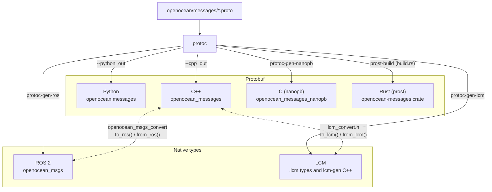

# openocean-messages

This project aims to provide a subset of common messages to improve interoperability between marine robotic systems, *regardless of middleware or programming language.*

In this repo are generic messages (defined in Protobuf) for ocean systems and tools to generate native formats from these messages. 

Messages are automatically converted to the desired output format as a first-class native type, so Protobuf is *not needed at runtime* for non-Protobuf output types (e.g. ROS Msg).

The output formats currently supported by this project are:

- Protobuf
    - C++ (built-in)
    - Python (built-in)
    - Rust (prost)
    - C (nanopb)
* ROS2 Msg
    - Conversion to/from Protobuf optional.
* LCM types
    - Conversion to/from Protobuf optional.

This project is an initiative of Open Ocean Software: https://oceansoft.org.

## How the outputs are generated

*This section was written by Claude.*

## Documentation

*This section was written by Claude.*

- [Messages](messages.md): the message definitions, their conventions, and how to extend them
- [Building](building.md): dependencies, outputs, and build options
- [Using from another project](using.md): installing, and `find_package(openocean_messages)`
- Outputs: [ROS 2](ros.md), [LCM](lcm.md), [nanopb](nanopb.md), [Rust](rust.md)
- [Compatibility checks](compatibility.md): ABI and Protobuf checks on pull requests
- [Development](development.md): repository layout, tests, and pinned versions

[openocean-messages-examples](https://github.com/openocean-software/openocean-messages-examples) has a small, independent example project for each output.
